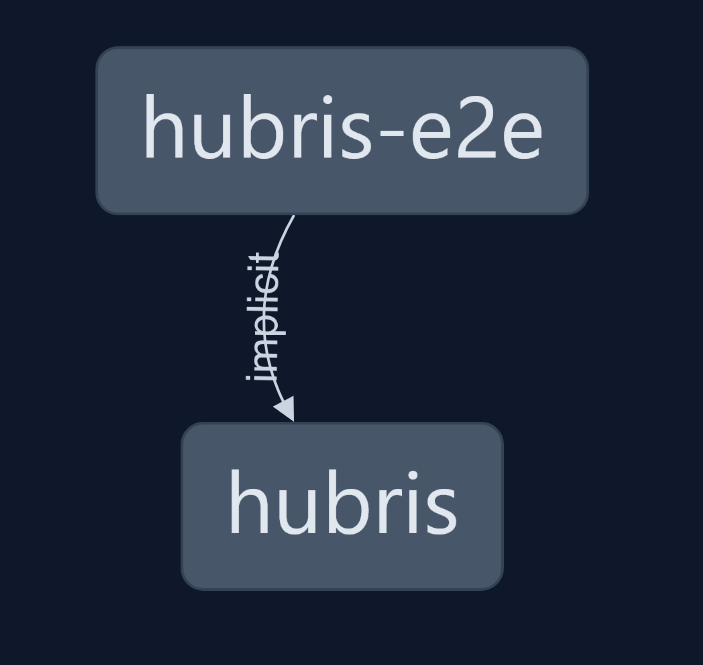
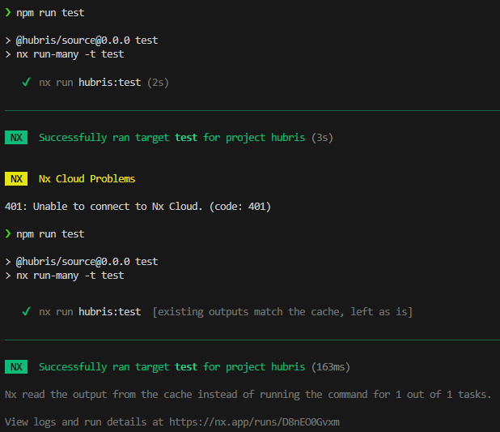

# Getting started

OK, enough background let's actually write some code. I ended last blog post extolling the virtues of Nx. This is going to be the place to start. It is possible to add Nx to an existing repository, but it is a lot easier to use it from the beginning. It also has many generators for adding new libraries and applications to an existing repo as well as a plugin system for adding new generators. This should help enabling new functionality quickly.

To start I run

```
npx create-nx-workspace project-hubris --packageManager=pnpm
```

I keep most of the default settings but selected empty project. I'll add libraries and applications manually. I opted to use GitHub as my build pipeline. I have heard great things about GitLabs, but I know almost nothing about it. Maybe it will be something to migrate to some point down the line. For now GitHub Actions should be entirely sufficient.

Let's take a look around, what did we get?

First we have a GitHub action yml file. This does some basic setup and then runs some tests. There is a recommended extensions json file in the `.vscode` folder. It only contains the Nx extension for Angular, and as I won't be using Angular I won't be installing it. There is a `.gitignore`, nothing special, just some good defaults. We've got an empty `packages` folder as well as a `pnpm-workspace.yaml` file that tells pnpm that our packages are in the `packages` folder. I will probably add an `applications` folder at some point going forward and update the workspaces folder. We've got a `packages.json` folder, just some defaults for now, and also a `README.md` with default content from Nx.

We also got a simple React web application and some end-to-end tests. I will want both of these at some point but there is not much of note in either.

Nx has some nifty tools including one to analyse our project dependencies. Running `nx graph` loads a tool that shows package dependencies. For now I only have two packages, and the e2e tests depend on the main React app. As I add more packages this graph should look more interesting.



One more thing that I want to add is the ability to test the whole repo from the top. This will be useful a lottle further down. Into the top level `package.json` I add a line in the scripts: `"test": "nx run-many -t test"`. This finds all packages with a `test` script and runs it - currently that is only the Hubris web app.



Looks good mainly. The script runs the single test in the package, then when I run exactly the same thing again without any changes it retrieves the cached result instead of re-running it. It looks as though I need to setup a connection to Nx Cloud (more on this later).

## A quick aside

You might be thinking "This guy wants to build the most scalable, maintainable, portable web application ever, and the first thing he types is `npx`. What a newb. Everyone know javascript/typescript is >>insert your favourite expletives here<<". (Maybe you don't think that - I am not here to start internet wars - just explore different tech and their applications.) However, typescript does provide the most comprehensive sets of libraries for building web pages. It is going to be hard to avoid it in the real world. Sure there other languages but nothing comes close to the ubiquity of React or Angular.

What makes this more defensible IMO is that Nx isn't just a javscript/typescript tool. It has support and generators for coordinating a polyglot mono-repo (supposedly). I am looking fowrard to seeing how possible it will be to add in more robust languages for other parts of this project. Or maybe this will be the first of my many mistakes, we'll see...

## Starting with some good practices

There are some things that I want to get right from the start that are not related to any piece of code, but more to how the repo is setup.
