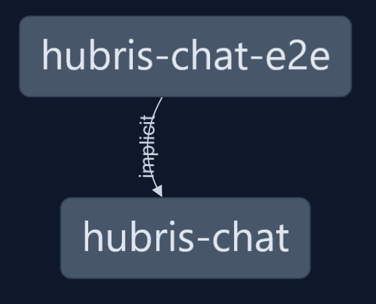
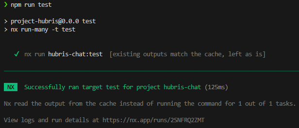

# Getting started

OK, enough background let's actually write some code. I ended last blog post extolling the virtues of Nx. This is going to be the place to start. It is possible to add Nx to an existing repository, but it is a lot easier to use it from the beginning. It also has many generators for adding new libraries and applications to an existing repo as well as a plugin system for adding new generators. This should help enabling new functionality quickly.

To start I run

```
npx create-nx-workspace project-hubris
```

I keep most of the default settings but selected empty project. I'll add libraries and applications manually. I opted to use GitHub as my build pipeline. I have heard great things about GitLabs, but I know almost nothing about it. Maybe it will be something to migrate to some point down the line. For now, GitHub Actions should be entirely sufficient.

Let's take a look around, what did we get?

First we have a GitHub action yml file. This does some basic setup and then runs some tests. There is a recommended extensions json file in the `.vscode` folder. It only contains the Nx extension for Angular, and as I won't be using Angular I won't be installing it. There is a `.gitignore`, nothing special, just some good defaults. We've got an empty `packages` folder as well as an entry in the `packages.json` file that tells npm that our packages are in the `packages` folder. The `packages.json` folder, just some defaults for now, and also a `README.md` with default content from Nx.

## A quick aside

You might be thinking "This guy wants to build the most scalable, maintainable, portable web application ever, and the first thing he types is `npx`. What a newb. Everyone know javascript/typescript is >>insert your favourite expletives here<<". (Maybe you don't think that - I am not here to start internet wars - just explore different tech and their applications.) However, typescript does provide the most comprehensive sets of libraries for building web pages. It is going to be hard to avoid it in the real world. Sure there other languages but nothing comes close to the ubiquity of React or Angular.

What makes this more defensible IMO is that Nx isn't just a javscript/typescript tool. It has support and generators for coordinating a polyglot mono-repo (supposedly). I am looking forward to seeing how possible it will be to add in more robust languages for other parts of this project. Or maybe this will be the first of my many mistakes, we'll see...

## Initial project

We need some web app if we want to explore how to make a good one. I install the Nx React templates and then use a generator to generate an application:

```
npm i @nx/react --save-dev
nx g @nx/react:application applications/hubris-chat --tags type:application,scope:chat
```

This has generated a template application with a basic page and routing. I will remove the content at some future point, but for now it is all we need. `nx run hubris-chat:serve` will serve the page, and similarly `nx run hubris-chat:test` runs the sample unit tests. It has also generated a simple end-to-end test.

Nx has some nifty tools including one to analyse our project dependencies. Running `nx graph` loads a tool that shows package dependencies. For now I only have two packages, and the e2e tests depend on the main React app. As I add more packages this graph should look more interesting.



## Starting with some good practices

There are some things that I want to get right from the start that are not related to any piece of code, but more to how the repo is set up.

### Commit hooks

With [trunk based development](./00-assumptions.md#trunk-based-development) we need to make sure that no commit can break the build - or at least limit the chances (if you want to go fast sometimes you break things, and I would rather have a quick [mean time to recovery](https://betterstack.com/community/guides/incident-management/mttr-and-other-incident-metrics/) than a slow time to deployment). The first line of defence is unit tests. I want to have the unit tests run every time a push is made. Fortunately, with Nx caching test results this scales really well even if this project were to grow really big.

The first step is to make it simple to run every test. Into the top level `package.json` I add a line in the scripts: `"test": "nx run-many -t test"`. This finds all packages with a `test` script and runs it - currently that is only the Hubris-chat web app.



Looks good. And it has even cached the results of the tests that I have previously done as I have made no code changes.

Next to make it run tests on commits. I install and initialise [husky](https://typicode.github.io/husky/). This is a tool that can run commands on various git commands, e.g. commits, pushes.

```
npm install --save-dev husky
npx husky init
```

This makes a default hook to test on each commit.


Running tests before each commit might not be exactly what I want - I can see arguments either way. On one hand, every commit should be a single piece of value that is individually deployable. On the other hand, sometimes you need to save some work in progress regardless if it is working or not.

I add a `pre-push` file to the `.husky` directory with the content `npm run prepush` and add a `prepush` script to the main `package.json` file which just delegates to running `test`. This level of indirection to prepush just helps to communicate intent.

### Conventional Commits

Conventional commits is a framework on how to structure a git commit message. It has the structure `<type>[optional scope]: <description>` (e.g. `fix(core): ensure that Foos always set the Bars correctly`). It has a few benefits:

1. It makes it simpler to scan the commit history. Every commit will have a lead description of whether is a feature, a fix, a test, documentation, etc, so scanning down the list of the commits it is easy to see what type of commit it is
   - The bonus is that it helps us to make each commit atomic. Say you make some changes to a feature and in the process realise that some of the documentation is not up to date - and so update it. What do you write in the conventional commit? It is both a documentation and a feature commit. The difficulty in finding the right conventional commit helps us to realise that we should be making these as two separate commits. If there is a problem with the feature changes - say it includes a bug or regression - then we don't want to revert the documentation changes if we revert the feature.
2. It makes doing semantic versioning a lot simpler. This makes it easier to see which packages will work or break with other combinations of packages.
3. It is easier to collate a changes log. Probably not super important for a personal project, but this is something that will be important for larger projects that I want to learn for.

The setup steps are fairly simple and listed on the [commitlint.js page](https://commitlint.js.org/guides/local-setup). Trying to commit with an invalid commit message is now rejected.

```
npm i commitlint @commitlint/config-conventional
echo "npx --no -- commitlint --edit $1" > .husky/commit-msg
echo "export default { extends: ['@commitlint/config-conventional'] };" > commitlint.config.ts
```


### Renovate

I do not like having dependencies that are out of date, but I like updating dependencies even less. Wouldn't it be great if:

1. There was a tool that could automatically update dependencies, and
2. We could write good enough tests so that an automatic tool could tell us if an upgrade broke our dependencies?

Well, good news: [Renovate](https://www.mend.io/renovate/) is a tool that does point 1, and we are in control of point 2. (Other tools are also available for point 1 - for example Dependabot, however Renovate is slightly more modern).

The process for starting with Renovate is really simple: just go to the [GitHub App](https://github.com/apps/renovate), install the app and it will automatically set itself up and create a PR to create an initial configuration.


As well as some instructions about next steps, the PR description contains all the PRs it will make to update existing dependencies. As it has been a few weeks since I intially created the workspace there are 27 packages that it has identified it can update.

Given that Renovate will raise a slew of PRs - once for every minor version update, I don't want to have a human in the loop for every one of these. It would easily become overwhelming. Instead I would like Renovate to check if a package upgrade is a minor version change or less, then run tests if so and automatically merge it if everything is good. I did consider including major version changes too, but I think I might like to see how this works in practice a bit before I try it.

I add the following fragment into the `renovate.json` config file, overriding the default `automerge: false` config. Note that this also requires enabling the automerge setting within the Settings page of the GitHub repo.

```
  "packageRules": [
    {
      "description": "Automerge non-major updates",
      "matchUpdateTypes": ["minor", "patch", "pin", "digest"],
      "automerge": true,
      "automergeStrategy": "fast-forward"
    },
    {
      "description": "Automerge dev dependencies",
      "matchDepTypes": ["devDependencies"],
      "automerge": true,
      "automergeStrategy": "fast-forward"
    }
  ],
```

# Summary

So, what have we got and how does it relate to what I set out in [post 1](./01-whatAmIBuilding.md)?

- We have a Nx based repository with a single web application. This will obviously need to be extended to resemble anything close to a 'real' web appication. But it sets the ground work for fast build and test cycle by leveraging Nx and its caching.
- We have protected the `main` branch by enabling pre-push testing hooks. With tests being fast this should give us a good combination of speed and safety.
  - There are some basic tests provided out-of-the-box from the Nx React template, but they will need expanding.
- As of yet, there is no provision for architectual choices like DDD, Ports-and-Adaptors or Clean Architecture. I intend to add these as the scope expands.

Overall, it seems like a good start, but still a long way off production ready. Part 3 will start to look at the domain and what functionality an app will need.
