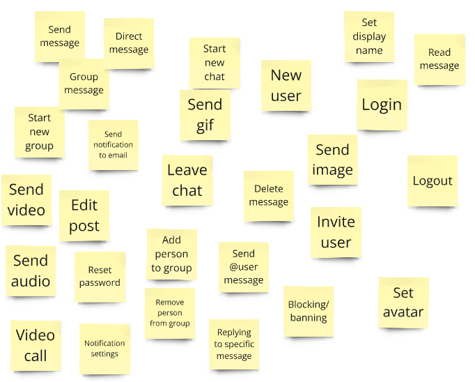
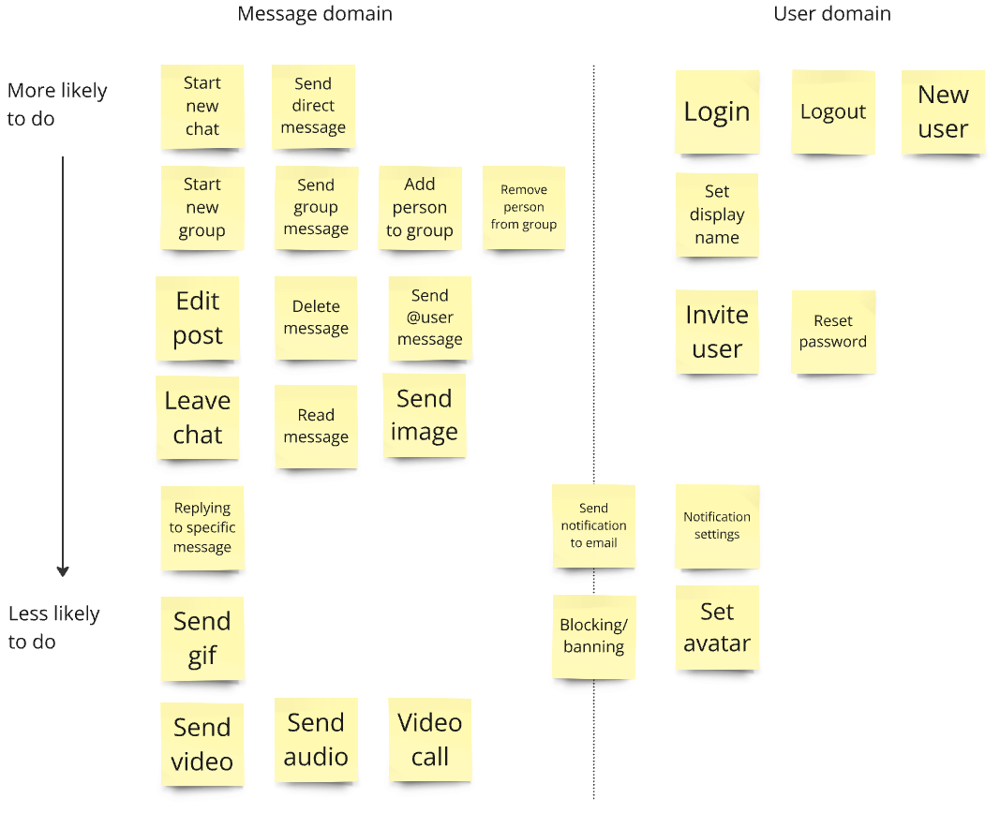

# Looking at the domain

So we're ready to smash out the first lines of code? Not quite yet unfortunately. Before we write anything we need to know what we are writing. I intend to leverage several tools from Domain Driven Design to drive out what I want to build, and also to look at how to go about building it.

## Event storming

First, I think about all the things that a messaging app could do - specifically all the actions that a user (or other actor) could take on a messaging system. A good way to do this is an excercise called event storming. This involves getting lots of sticky notes, writing a potential action on each and sticking them on a board. This exercise is often done with a large group of people (from engineering, product, delivery, etc...) to get many perspectives. I did it as just myself on a virtual board.

This exercise has a few benefits:

- It helps to define the boundary of the application - it gives us a way of focusing on what the system will do. It also helps to explicitly think big and then refine later. I have added video and audio notes to my event board which is definitely messaging-app-adjacent functionality. Adding these edge uses it can stimulate discussion on what is in and out of scope. For example, I don't think I will be getting into video calling.
- It helps to highlight where there might be ambiguous language. In my event board I have "person" and "user" mentioned. Are these the same concepts? What about "message", "chat" and "post"? DDD is big on using [Ubiquitous Language](https://martinfowler.com/bliki/UbiquitousLanguage.html) and I want to start coalescing the language that has come out of this exercise.
- We can look at themes in the events. Where there are multiple people collaborating on this exercise there are likely to be duplicates so these can be de-duped (not the case when I did mine), but even then there are likely to be groups of events that are related. These can start to become the basis for different domains and then maybe services at some point down the line. I did some grouping and found that I broadly had a Messaging domain and a User domain.

Here are the two domains in two separate columns. I wasn't sure where Sending Notifications or Banning/Blocking belonged, so they are in the middle until when (if) I explore them more. I also took the opportunity to do a small amount of prioritisation with the things that I am more likely to do first and then lower priority lower down.

## Ubiquitous language

As mentioned above I have several terms that are ambiguous regarding whether they mean the same thing or subtly different things. I want to put some definition around what each of these means and make them a lot more rigid. In a business environment this would almost certainly include various stakeholders debating back-and-forward different nuances until everyone came to a consensus on what a particular term means and all the nuances thereof.

One example that I have had experience of and found particularly useful to demonstrate this is where we have had both `User`s and `Person`s. Oftentimes a `User` has a one-to-one relationship with a `Person`, but not all of the time. In this project a `User` is an actor that interacts with our system - it can make modifications to the business objects. These were primarily humans, but we had various system users that, for example, set statuses from `READY` to `ACTIVE` if certain criteria were met. On the other hand, a `Person` represents a real human being. Usually these `Person`s are captured in the system and associated to users, but occasionally this not the case, e.g. Davey Mc Daveson needs to do task X, but they have not created an account yet.

Soo.... // TODO

## Entities, Aggregates and Value Objects
